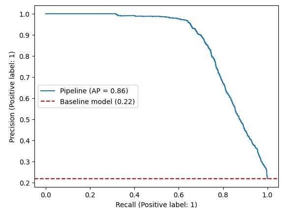
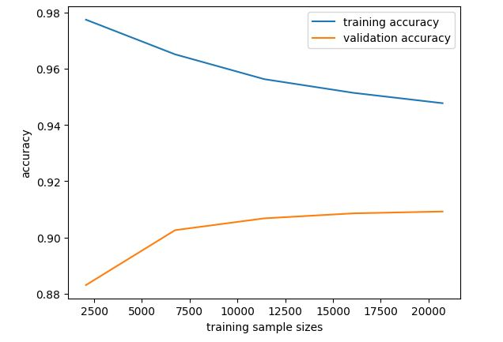

# Credit Risk Analysis

Welcome to my **Credit Risk Analysis** project! This project demonstrates a machine learning approach to analyzing credit risk, using a dataset of customer financial and demographic information to predict loan approval decisions.

## Project Overview
- **Tools**: Python, Jupyter, Scikit-learn
- **Skills Applied**: Data Cleaning, Feature Engineering, Model Optimization, Classification
- **Models Used**: Logistic Regression, Decision Trees, Random Forest, Gradient Boosting
- **Dataset**: [Download the dataset here](./credit_risk_dataset.csv)

## Key Features
- Processed and analyzed over 32,000 customer records.
- Removed 5% of outliers to improve model performance.
- Used **Column Transformer** and **Pipeline** to streamline the feature engineering process.
- Optimized models using **Randomized Search** for hyperparameter tuning.
- Achieved a weighted average **F1-Score of 0.91** across multiple classifiers.

## Key Visualizations
 **Precision-Recall Curve:** 

 

**Learning Curve:** 

 

View the full analysis: [Credit Risk Analysis](./Credit_Risk.html)

## Project Files
- Download the Jupyter Notebook: [Credit_Risk.ipynb](./Credit_Risk.ipynb)

## Contact
Feel free to reach out if you have any questions or feedback!
- **Email**: reyhaanbinny97@gmail.com
- **LinkedIn**: https://www.linkedin.com/in/reyhaanbinny

